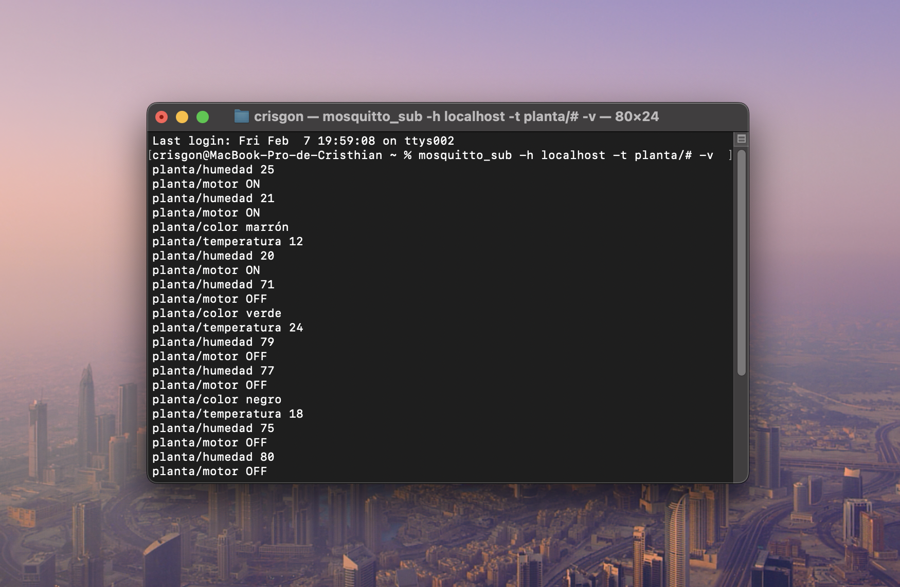
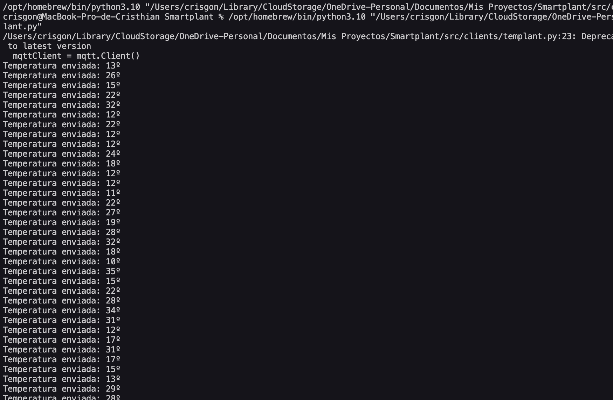
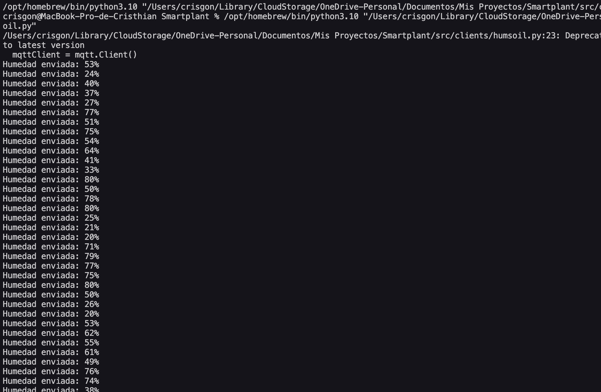
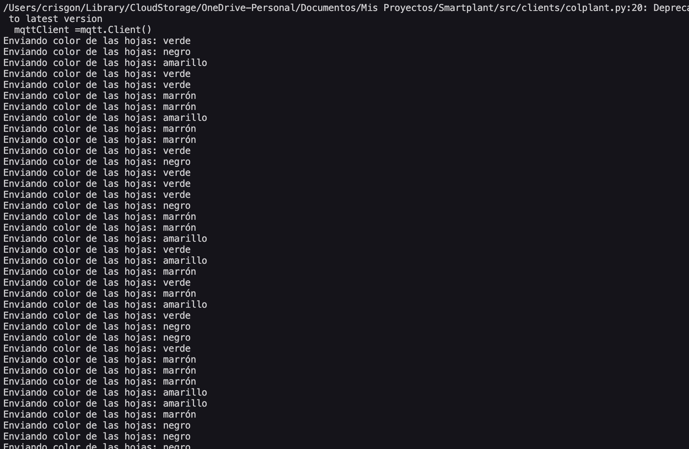
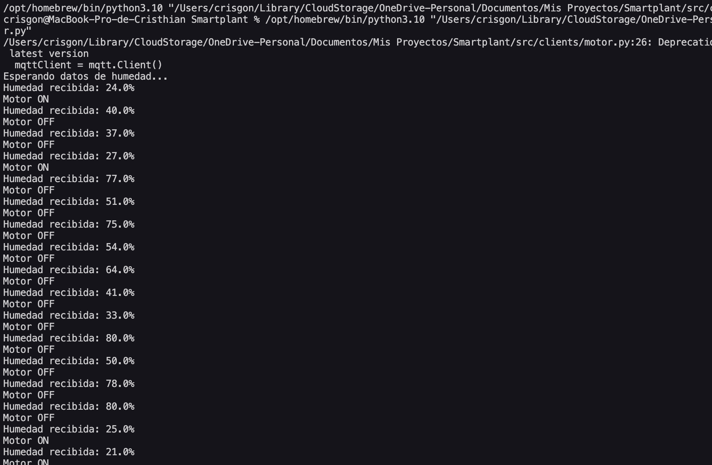

# SMARTPLANT

## Sistema domótico de control de plantas con MQTTT

Smartplant trata de una simulación de  un sistema domótico para el control de plantas, se nos pide implementar un broker y 4 clientes MQTT, ademas de un interfaz con gráficos.

Para empezar necesitamos Mosquitto para trabajar con MQTT, y la librería PAHO para Python. En MacBook para instalar mosquito debemos tener homebrew y usar el comando: brew install mosquitto, para instalar PAHO con python se instala la librería con el comando: pip install paho-mqtt.

Al instalar el broker mosquitto hay que iniciarlo con brew services start mosquitto. Con esto en marcha empecé a crear el proyecto en Visual Studio Code donde cree varios archivos .py que serán los clientes que publiquen en el broker. 

Cada archivo python simulará una cosa, tendremos: 

* Un sensor de temperatura que publica un numero aleatorio entre 10º y 35º cada 10 segundos.

* Un sensor de humedad que publica un numero aleatorio entre 20 y 80 (%) cada 5 segundos.

* Un sensor de colores que detecta plagas, los colores de las plantas pueden cambiar de verde a amarillo, de amarrillo a marrón, de marrón a negro.

* Una simulación de un motor de agua que se enciende cuando la humedad está baja. 

Los sensores de temperatura, humedad y color son muy parecidos entre sí en cuanto a código, ya que solo hay que generar valores aleatorios que simulen que está enviando algo, por ello hay que hacer uso de la libreria random, para generar estos numeros aleatorios en un intervalo de tiempo y que el cliente, es decir nuestro código, publique en el topico correspondiente un valor aleatorio cada x segundos. 

Con el color tambien he usado random usando la función choice sobre un arreglo de colores para que selecciona un color aleatorio y lo publique en el topico planta/color.

Para el motor hay que escribir un poco más de código ya que quiero que cuando la humedad esté por debajo del 30 % este encienda el motor, y para ello el motor necesitar suscribirse al topico de humedad y así obtener su valor para que cuando se cumple una condición este publique una cosa u otra.

Para probar como está funcionando nuestro sistema domótico necesitaré hasta 5 terminales, una para suscribirse a todos los topicos de las plantas, y las cuatro restantes para ejecutar los scripts y que publiquen lo que he programado. Yo he usado una terminal del propio mac, y terminales de Visual Studio Code ya que se puede ejecutar los scripts en un terminal dedicado.

###### Terminal de Broker

###### Terminal de Temperatura

###### Terminal de Humedad

###### Terminal de Color

###### Terminal de Motor
